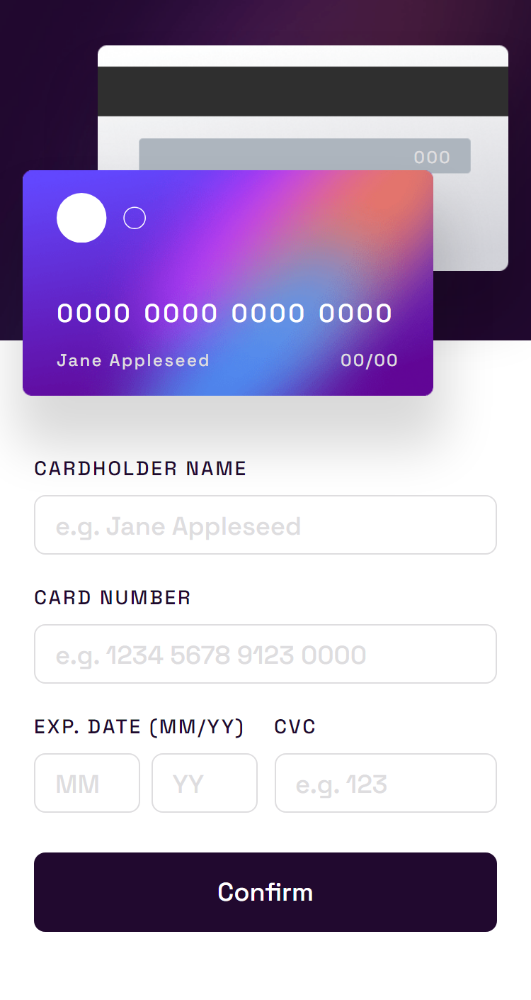
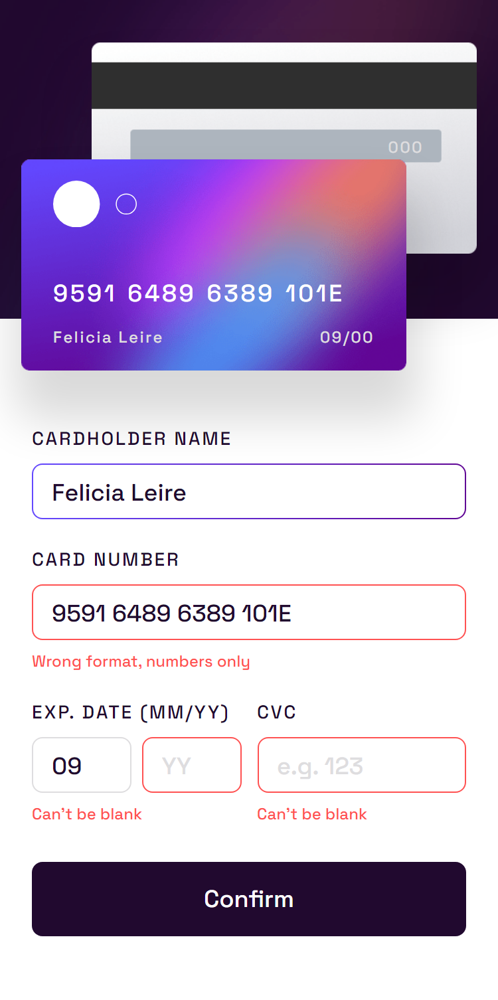
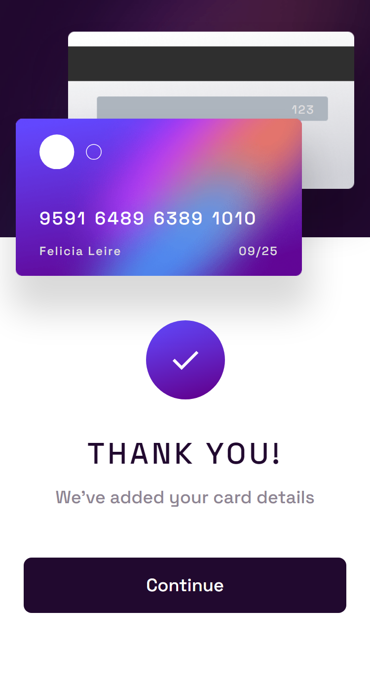
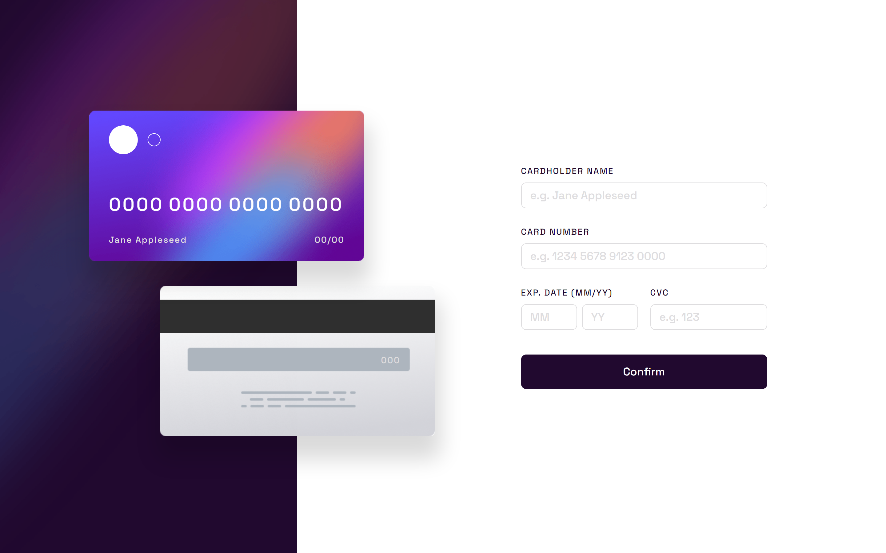
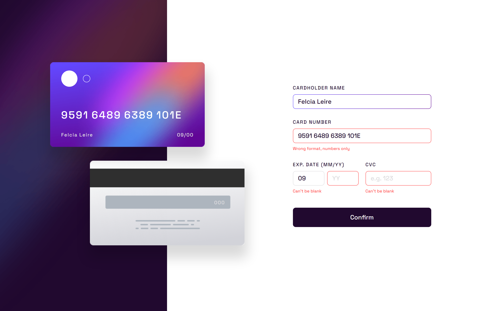
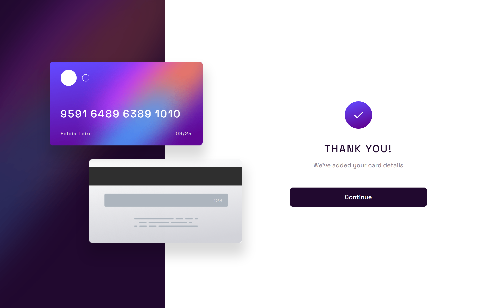

# Frontend Mentor - Interactive card details form solution

This is a solution to the [Interactive card details form challenge on Frontend Mentor](https://www.frontendmentor.io/challenges/interactive-card-details-form-XpS8cKZDWw). Frontend Mentor challenges help you improve your coding skills by building realistic projects.

## Table of contents

- [Overview](#overview)
  - [The challenge](#the-challenge)
  - [Screenshot](#screenshot)
  - [Links](#links)
- [My process](#my-process)
  - [Built with](#built-with)
  - [What I learned](#what-i-learned)
  - [Continued development](#continued-development)
- [Author](#author)

## Overview

This is the third challenge in the **Modern Styling Roadmap**. The purpose of which is to consult and practice modern ways of styling frontend apps.

The challenge consists of a form that provide instant feedback by displaying the information entered by the user into images. The form must be validated before showing a thank you for submitting view.

### The challenge

Users should be able to:

- Fill in the form and see the card details update in real-time **(DONE)**
- Receive error messages when the form is submitted if:
  - Any input field is empty **(DONE)**
  - The card number, expiry date, or CVC fields are in the wrong format **(DONE)**
- View the optimal layout depending on their device's screen size **(DONE)**
- See hover, active, and focus states for interactive elements on the page **(DONE)**

### Screenshot

#### Mobile

##### Initial View



##### Active View



##### Final View



#### Desktop

##### Initial View



##### Active View



##### Final View



### Links

- Solution URL: [Add solution URL here](https://your-solution-url.com)
- Live Site URL: [Add live site URL here](https://your-live-site-url.com)

## My process

### Built with

- Semantic HTML5 markup
- CSS custom properties
- Flexbox
- CSS Grid
- Mobile-first workflow
- [React](https://reactjs.org/) - JS library
- [TypeScript](https://www.typescriptlang.org/) - Type Checking Language Built on top of Javascript.
- [Vite](https://vitejs.dev/) - Bundler and development environment for Frontend.
- [ChakraUI](https://v2.chakra-ui.com/) - simple, modular and accessible component library.
- [Formik](https://formik.org/) - Form Library for React and React Native
- [Yup](https://www.npmjs.com/package/yup) - Schema builder for runtime value parsing and validation

### What I learned

For this project I used **ChakraUI** as my main way to achieve the design of the project. **ChakraUI** provides a lot of different components (layout, form, display and so on). that have base styles and variants / sizes / different color schemes that you can choose from.

The thing that I liked is that each component accepts styles props. which corresponds to CSS Properties. below is an example of a FormLabel Component that I used in this project to display the labels of our form controls. (notice the fontSize prop that is the syntax to manage responsive breakpoints)

```tsx
import { FormLabel as ChakraFormLabel, FormLabelProps } from "@chakra-ui/react";

export default function FormLabel(props: FormLabelProps & { label: string }) {
  return (
    <ChakraFormLabel
      letterSpacing="widest"
      color="violet.black"
      textTransform="uppercase"
      fontSize={{ base: "xs", sm: "sm" }}
      mx="0"
      {...props}
    >
      {props.label}
    </ChakraFormLabel>
  );
}
```

You might notice from the example above that the values do not exist on the CSS specification. this is because those values are configured in a theme object that you can customize with you own colors, spacing, fontSizes and so on. making it easy to reference your design tokens when styling the components.

Many of the theme is similar to the theme of tailwind. so my knowledge on tailwind really helped here.

You can see the customized theme in the `src/theme/index.ts`. For managing the form I used **Formik**. it provides a couple of components and hooks to manage form validation and display of errors.

For the validation I used **Yup** to write a schema and pass that to **Formik** which will use it to validate the different fields.

### Continued development

The difference between using tailwind and ChakraUI for me was that they both allow you to mix the component markup + functionality with the styling in the same file. However ChakraUI provides more functionality, focuses more on accessibility and uses styles props which looks more good when you're reading the code than a single className prop for styling.

However for me they're both a good choice. ChakraUI might be a better if you use their UI Figma Kit to design the application.

I want to do one more challenge with these tools. as I struggled in completing this one since it's my first time using: **ChakraUI, Formik and Yup**.

## Author

- Frontend Mentor - [@ilyesab](https://www.frontendmentor.io/profile/ilyesab)
